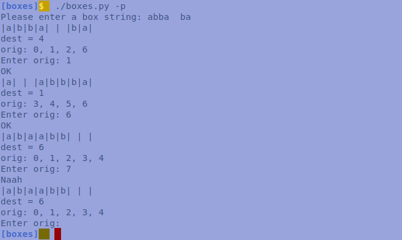
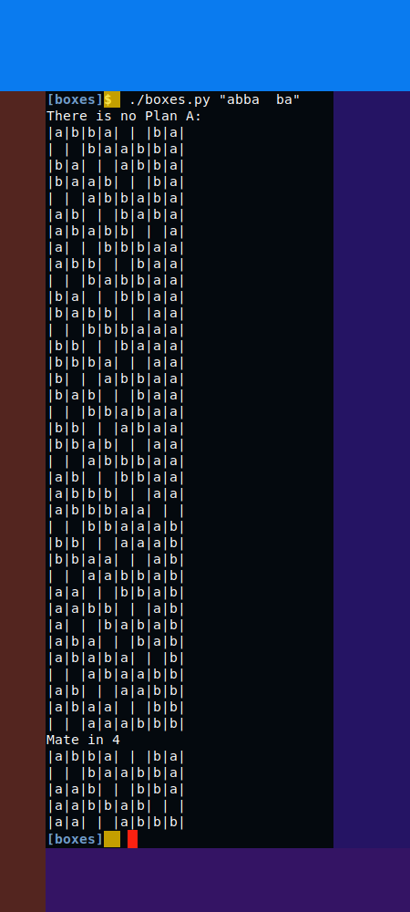
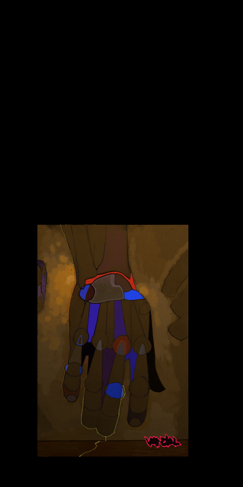

## Boxes

You can view the problem over
[**here**](https://ioinformatics.org/files/ioi1989problem1.pdf).
Initially thought it's a *permutation* problem, but after few tries
gave up, and decided it's a **tree** problem, like I have to build a
tree with all possible positions etc., later however realized that
it's a ***search*** problem, which seems most closely related to the
chess problem of finding a mate. Speaking abstractly, usually tree
node has links to its subtrees, but over here we don't need that
stuff, coz if we find a mate position, we have to go backward, not
forward. **thatz** why instead of the usual *llnk* and *rlnk* or
whatever, tree nodes have *parent* link.

`Please enter a box string:`

*OK*, the *1st* part of the problem is a bit trivial, but if you want to play
the game of `|a|b|b|a| | |b|a|` it might be handy. Here is a sample game session:

Probably I will disappoint you, but if you solve the puzzle nothing
will happen:) The box string can be set on command line as well, but
has to be quoted. If you want to exit just hit Enter, the program
will catch an exception and terminate.

## Plan B and Depth Srch

By definition trees are recursive, so the most natural way to walk
through a forest is with recursive calls. The problem iz coz of the
repetitions trees formed from any position are infinite.  ***thatz***
why we have to use a history or log stack to keep records on visited
positions.  Imagine we have a root with 2 branches and a *mate in one*
in the right branch. Than bcoz of the recursive calls we can't enter
the second branch before walking the left one, but until than all
positions can be exhausted and we'll get bunch of solutions but not
the right one.

***thatz*** *why we have to* use a **non-recursive** method for *cking **parent**
nodes* before *children* nodes, becoz the solution with *mininal exchanges* will be
the solution with lowest *level*, recall that ***root*** has level *0*, and all children
nodes has one level greater than their parents. In the program depth srch is implemented
by using two alternating stacks for parent and children nodes respectively. 

https://youtu.be/vZLQCDteqno
